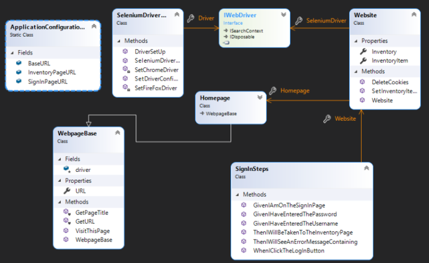

# SauceDemoTestSuite
A framework to test the SauceDemo website.

## Deliverables

* Detailed user stories at the top of each Feature file (e.g., SignIn.feature)
* Test frame work using page-object model framework
* Class diagram
* All tests accompanied by Gherkin statements

## Setup

* Download Github repository
* Open the solution in Visual Studio
* Open the Test Explorer
* Run all tests.

NuGet Packeges used:

* Nunit 
* NUnit3TestAdapter
* Gherkin
* SeleniumWebDriver
* SeleniumWebDriver.ChromeDriver
* SpecFlow
* SpecFlow.NUnit

## Class Diagram

SauceDemoTestSuite contains:
* Application Configuration Reader: Reads the website page URLs from app.config
* A Library containing:
     * Selenium Driver Configuration
     * Website Class
     * Website Pages-object models, based on the WebPageBase class.
* A test folder containing
     * Features and tests written in Gherkin syntax
     * Test Steps which use the page-object models to access the web pages.

## Further Work

Implement new tests:

* Basket Page
  * Continue Shopping button
  * Remove Item
  * Checkout
* Checkout Form
  * Validation
  * Cancel
  * Continue
* Checkout Overview
  * Price Total
  * Cancel
  * Finish
  * Taken to Completion Page

## Retrospective

* Creating frameworks to test websites is a lot of fun. I imagine it will be easier when collaborating with a business analyst and the web developer.
* Sometimes it was necessary to use CSS selectors to find the web elements instead of IDs, because they were not provided. This proved troublesome due to copy-paste errors. Selenium was helpful to find the correct CSS tag, but errors still occurred. In future, perhaps it may be better to use a framework for CSS language support, similar to how Entity Framework provides SQL language support.
